<div align="center">
  
</div>

# RoboDyna

**RoboDyna** is a dual-arm robotic manipulation benchmark for **highly dynamic** environments. Tasks emphasize timing, prediction, and reactive control — moving objects, time-limited windows, distractors, and household physics — rather than static pick-and-place.

Built on [RoboTwin 2.0](https://github.com/RoboTwin-Platform/RoboTwin) / DOMINO with **SAPIEN 3.0.3** and a dual-UR5 (`ur5-wsg`) embodiment. The suite includes **23 base** tabletop tasks (each with Default / Opt 1 / Opt 2 / Opt 1+2 variants) and **12 household** office/kitchen tasks. You can explore tasks interactively (robot or keyboard+mouse), collect expert trajectories (HDF5 + LeRobot), and run guided human-evaluation experiments.

## Sample tasks

<div align="center">
  
  
  
  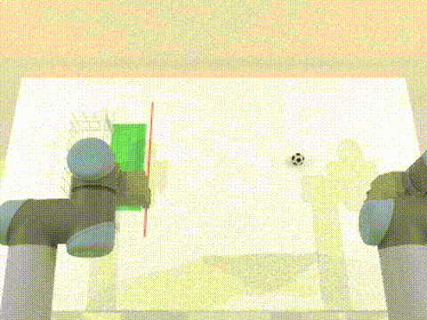
</div>
<div align="center">
  
  
  
  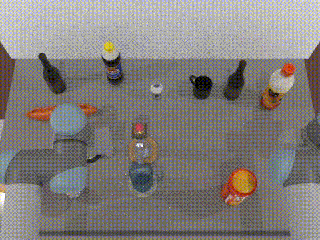
</div>

## Installation

**Requirements:** Linux, NVIDIA GPU, Python 3.10, CUDA-capable driver, Vulkan, FFmpeg.

```bash
# System deps (once)
sudo apt update
sudo apt install -y libvulkan1 mesa-vulkan-drivers vulkan-tools ffmpeg

# Create conda env `robodyna` and install packages (SAPIEN 3.0.3, CuRobo, …)
bash script/install_robodyna.sh
conda activate robodyna
```

Override the env name with `ROBODYNA_ENV=myenv bash script/install_robodyna.sh` if needed. On aarch64 / GB10, use `scripts/build_domino_aarch64.sh` instead.

### Download RoboTwin assets

Stock meshes, embodiments, and background textures come from the RoboTwin 2.0 Hugging Face dataset (not in git):

```bash
conda activate robodyna
bash script/_download_assets.sh
```

If you hit rate limits, run `huggingface-cli login` first. This unpacks `assets/objects/`, `assets/embodiments/`, and `assets/background_texture/`, then updates embodiment config paths.

Before any headless collection / recording:

```bash
export VK_ICD_FILENAMES=/usr/share/vulkan/icd.d/nvidia_icd.json
unset DISPLAY
```

## Usage

### Data collection

Collect expert trajectories with the shared collector. Use the shared config **`demo_dynamic`** (production) or **`debug_dynamic`** (short debug runs):

```bash
conda activate robodyna
export VK_ICD_FILENAMES=/usr/share/vulkan/icd.d/nvidia_icd.json
unset DISPLAY

bash scripts/collect_data.sh <task> <task_config> <gpu_id>

# Examples
bash scripts/collect_data.sh cook_meat demo_dynamic 0
bash scripts/collect_data.sh boil_milk demo_dynamic 0
```

Output lands under `data/<task>/<task_config>/` (HDF5 + mp4) and an inline LeRobot v2.1 dataset under `data_lerobot/`. Task-specific knobs live in `task_config/demo_dynamic.yml` under `task_args.<task>` (do not add a separate per-task config file).

### Interactive GUIs

Interactive viewers let you play tasks with **robot** control or **keyboard+mouse**, optionally with a pre-play briefing and recording.

**Launcher (recommended)** — opens Base, Household, and Experiment from one window:

```bash
conda activate robodyna
python interactive/robodyna_gui.py
```

**Or launch a suite directly:**

```bash
python interactive/base_task_gui.py        # 23 base tasks (+ tutorial)
python interactive/household_task_gui.py  # 12 household tasks
python interactive/experiment_gui.py     # human-evaluation protocol
```

You can also run an individual interactive script, e.g. `python interactive/base/interactive_cook_meat.py` or `python interactive/household/interactive_boil_milk.py`.

**Header options** (base / household task GUIs):

| Option | What it does |
|---|---|
| **Instructions** | Show a task briefing (language + controls) before the viewer opens |
| **Record data** | After the episode, write HDF5 / LeRobot-style episode data under `data/<task>/…` |
| **Save video** | Save a head-camera preview mp4 after the viewer closes |
| **Seed** | Fixed seed, or blank for a fresh random seed each play |
| **Control** | `robot` (dual-arm teleop / planner control) or `keyboard+mouse` |

Base tasks expose four scenario columns (Default / Opt 1 / Opt 2 / Opt 1+2). Household tasks use per-episode randomization via the seed.

## Human experiments

Guided human evaluation with login, surveys, sampled task sets, and per-participant logs.

### Launch

```bash
conda activate robodyna

# From the shared launcher → Experiments card, or:
python interactive/experiment_gui.py

# Equivalent entry from the suite launcher:
python interactive/robodyna_gui.py
```

### Procedure

1. Enter a **unique participant name**. New names create a log folder; **returning the same name continues** that participant (skips the pre-survey, restores progress).
2. Complete the **pre-experiment questionnaire** (first visit only).
3. Choose a **controller**: Robot or Keyboard + mouse. Progress is tracked **separately** per controller (`user_robot.json` vs `user_keyboard.json`).
4. Open the **Base** and/or **Household** suite cards. Only the **sampled** tasks for this participant are playable; others stay grayed out.
5. Play assigned scenarios until slots complete (success/failure counts toward the play limit; Stop / early close does **not** consume a slot).
6. Optionally submit the **post-experiment questionnaire** from the suite screen.

### Config

Protocol settings live in [`interactive/experiment.yml`](interactive/experiment.yml) (override path with `ROBODYNA_EXPERIMENT_CONFIG=/path/to.yml`):

- `seed` — `null` (random each play), a fixed int, or a cycling list
- `plays_per_scenario` — how many terminal SUCCESS/FAILURE plays lock a slot
- `record_data` / `save_video` / `log_plays` — recording and logging (locked in the task GUIs during experiment mode)
- `base_tasks` / `household_tasks` — candidate pools (1-based card numbers)
- `base_scenarios_per_experiment` / `household_scenarios_per_experiment` — how many tasks to sample per participant
- `base_task_categories` / `household_task_categories` — skill / difficulty buckets used for balanced sampling

### Task sampling

Each **new** participant is assigned a sampled set once and stored in `data/exp_logs/<user>/assignment.json` (shared across robot and keyboard logs). Sampling prefers tasks with the **lowest usage** across remaining participants (`data/exp_logs/base_task_usage.json` / household usage), drawn from the category lists intersected with the candidate pools. Returning participants keep their original assignment.

### Logs

Logs are written under:

```text
data/exp_logs/<user_slug>/
  assignment.json       # sampled base + household tasks (stable for this user)
  user_robot.json        # robot-controller plays + surveys
  user_keyboard.json     # keyboard+mouse plays + surveys
```

The slug is the participant name, lowercased, with spaces turned into underscores. Each controller log stores experience / post-survey answers, play counts, and per-play records (task, scenario, seed, result, timings, metrics). Names are unique per folder: reuse a name to **continue**; pick a new name for a new participant.

## 📋 Tasks

Every task below has a head-camera expert demonstration for each condition (policy-rate capture, ~30 Hz).
The clips are converted to GIFs for in-page playback; the condition shown below each GIF describes that column's setup.

| Task | Default demo | Opt 1 demo | Opt 2 demo | Opt 1+2 demo |
|---|---|---|---|---|
| **`catch_marbles_trapdoors`**<br><sub>Time the matching colored key press to drop the target marble through its trapdoor.</sub> | <div align="center"><br><sub>Doors open 3 times only; no distractor.</sub></div> | <div align="center"><br><sub>Each door opens once; no distractor.</sub></div> | <div align="center">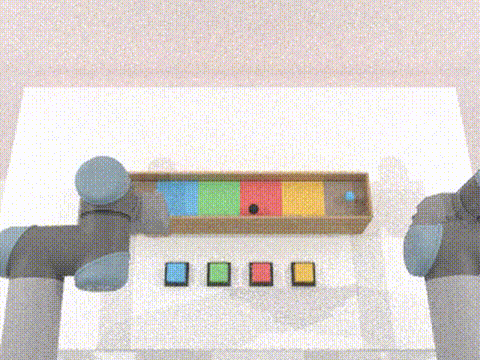<br><sub>Reusable doors with a distractor marble.</sub></div> | <div align="center"><br><sub>One-use doors with a distractor marble.</sub></div> |
| **`catch_ramp_ball`**<br><sub>Catch a red ball leaving a ramp in a cup without catching a distractor.</sub> | <div align="center">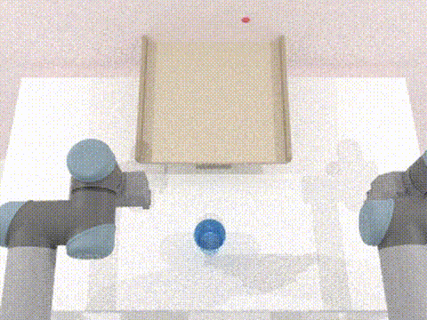<br><sub>Straight ramp exit; no distractor.</sub></div> | <div align="center">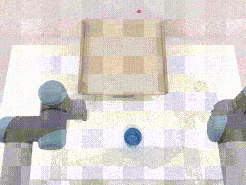<br><sub>Ball rebounds from a wall.</sub></div> | <div align="center">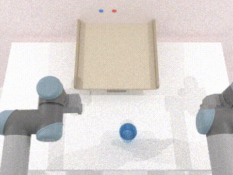<br><sub>Straight exit with a blue distractor.</sub></div> | <div align="center">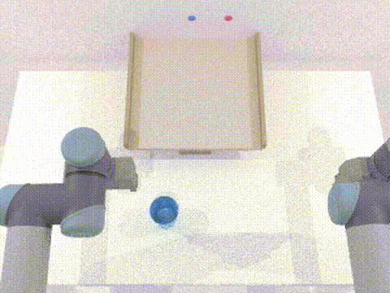<br><sub>Wall rebound with a blue distractor.</sub></div> |
| **`catch_cuboid`**<br><sub>Grasp the cuboid or cuboids during their timed pop-up windows.</sub> | <div align="center">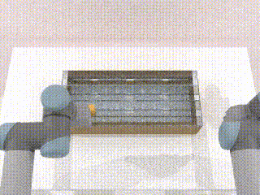<br><sub>One cuboid; transparent board.</sub></div> | <div align="center"><br><sub>Two simultaneous cuboids; transparent board.</sub></div> | <div align="center">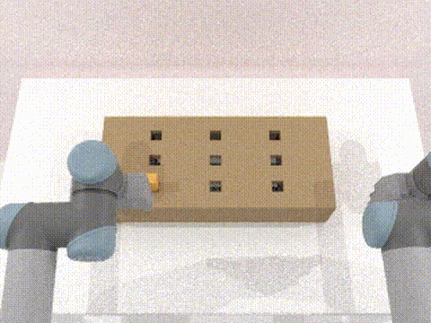<br><sub>One cuboid; opaque board.</sub></div> | <div align="center">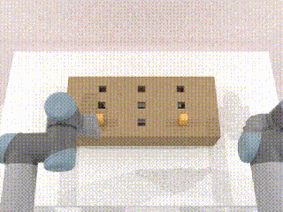<br><sub>Two simultaneous cuboids; opaque board.</sub></div> |
| **`catch_shelf_marble`**<br><sub>Slide a bowl along the belt to catch a marble rolling off tilted shelves.</sub> | <div align="center">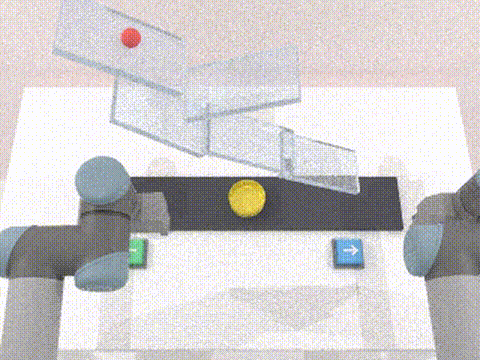<br><sub>Marble waits for a bowl-key press.</sub></div> | <div align="center">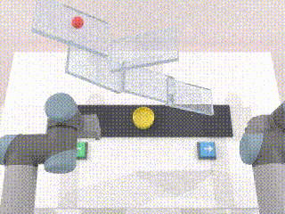<br><sub>Marble moves from episode start.</sub></div> | <div align="center"><br><sub>One non-top shelf oscillates.</sub></div> | <div align="center">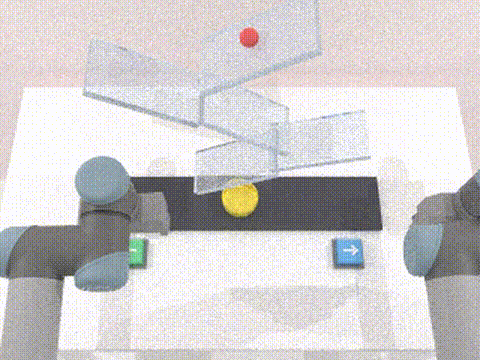<br><sub>Immediate marble motion and an oscillating shelf.</sub></div> |
| **`catch_valley_ball`**<br><sub>Place a bowl beyond the line to catch a red ball leaving a curved ramp.</sub> | <div align="center">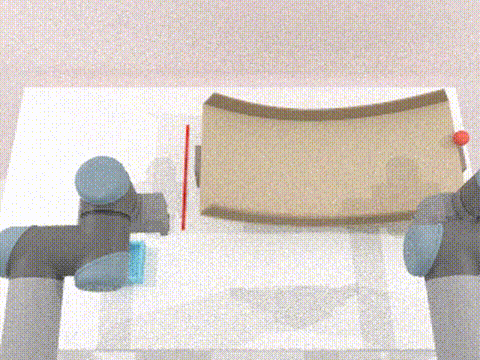<br><sub>Straight exit; no distractor.</sub></div> | <div align="center">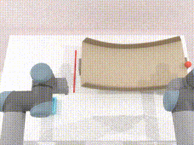<br><sub>Red ball rebounds from a side rail.</sub></div> | <div align="center">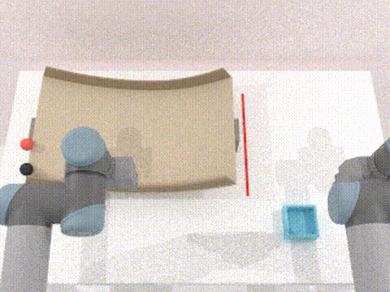<br><sub>Straight exit with a black distractor.</sub></div> | <div align="center">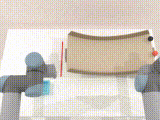<br><sub>Wall rebound with a black distractor.</sub></div> |
| **`stop_valley_ball`**<br><sub>Hold a ping-pong bat mid-air so the red ball hits its circular head before falling to the table.</sub> | <div align="center">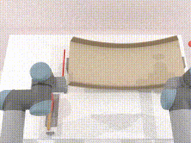<br><sub>Straight exit; no distractor.</sub></div> | <div align="center">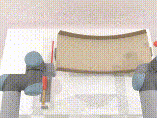<br><sub>Red ball rebounds from a side rail.</sub></div> | <div align="center">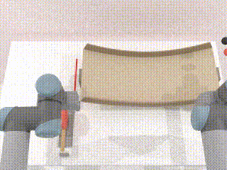<br><sub>Straight exit with a black distractor.</sub></div> | <div align="center">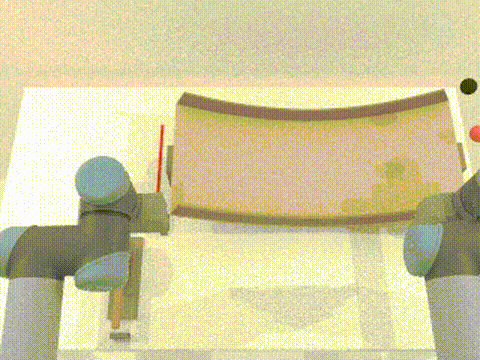<br><sub>Wall rebound with a black distractor.</sub></div> |
| **`cook_meat`**<br><sub>Cook steak on a pan to the target doneness and return it to the board.</sub> | <div align="center"><br><sub>One station; cook by pan contact.</sub></div> | <div align="center"><br><sub>One station; hold the cook key.</sub></div> | <div align="center"><br><sub>Two stations; cook by pan contact.</sub></div> | <div align="center">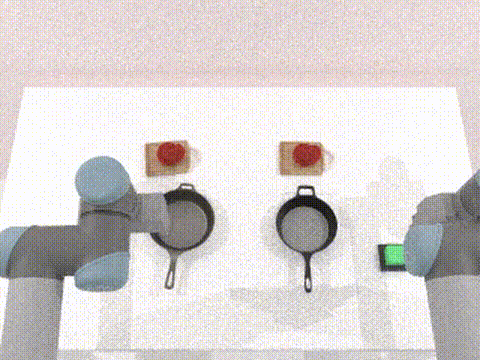<br><sub>Two stations; each uses a cook key.</sub></div> |
| **`cook_meat_timer`**<br><sub>Cook steak with a pie timer (green→yellow→red) that tracks doneness, then return it to the board.</sub> | <div align="center">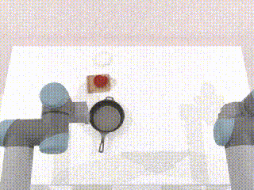<br><sub>One station; timer advances on pan contact.</sub></div> | <div align="center">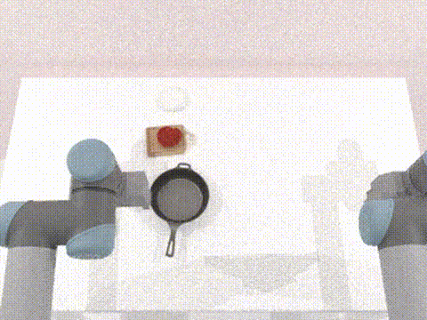<br><sub>One station; timer runs while the cook key is held.</sub></div> | <div align="center"><br><sub>Two stations; contact cook with a pie timer each.</sub></div> | <div align="center">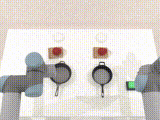<br><sub>Two stations; each key holds its own pie timer.</sub></div> |
| **`put_cup_belt`**<br><sub>Carry a cup through the workspace and place it in the slot between the tools.</sub> | <div align="center">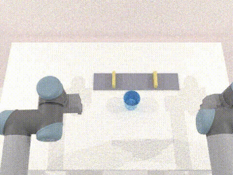<br><sub>No curtains.</sub></div> | <div align="center"><br><sub>Static blue curtains.</sub></div> | <div align="center"><br><sub>Swaying blue curtains.</sub></div> | <div align="center"><br><sub>Mix of static and moving curtains.</sub></div> |
| **`dispense_gummy`**<br><sub>Operate a dispenser and moving bowl so only target-colored gummies are collected.</sub> | <div align="center"><br><sub>Alternating layout; discrete bowl hops.</sub></div> | <div align="center">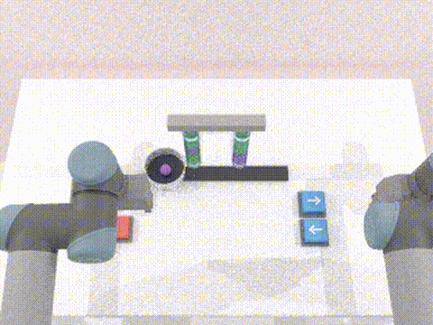<br><sub>Randomized gummy layout; discrete bowl hops.</sub></div> | <div align="center">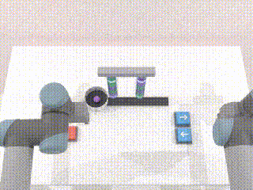<br><sub>Alternating layout; continuous bowl motion.</sub></div> | <div align="center"><br><sub>Random layout and continuous bowl motion.</sub></div> |
| **`punch_dual_holes`**<br><sub>Use both arms to punch every present tile on two belts.</sub> | <div align="center"><br><sub>Discrete stops; both tiles present.</sub></div> | <div align="center">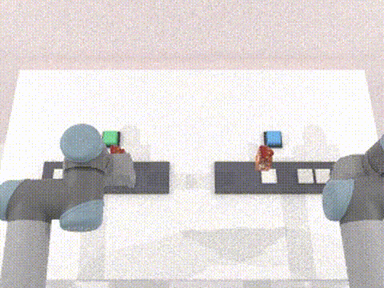<br><sub>Discrete stops with a missing tile.</sub></div> | <div align="center">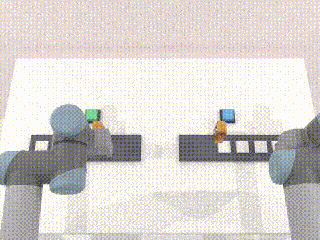<br><sub>Continuous belt; both tiles present.</sub></div> | <div align="center">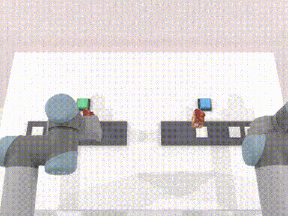<br><sub>Continuous belt with a missing tile.</sub></div> |
| **`save_goal`**<br><sub>Place the keeper before the deadline to block the ball from entering the goal.</sub> | <div align="center"><br><sub>Direct shot.</sub></div> | <div align="center">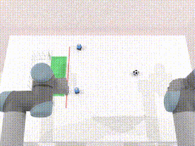<br><sub>Shot bounces off field players.</sub></div> | <div align="center">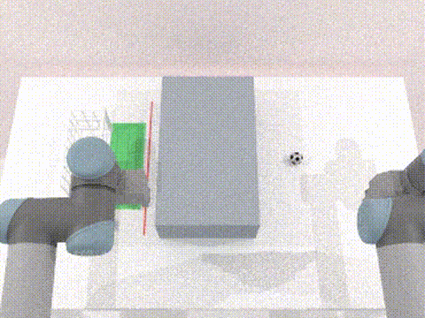<br><sub>A mid-field cover briefly occludes the ball.</sub></div> | <div align="center">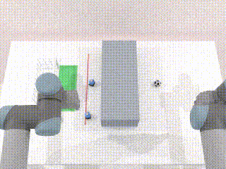<br><sub>Field-player bounce and a mid-field cover.</sub></div> |
| **`hit_target`**<br><sub>Use a stick to hit the moving target's yellow center while avoiding blockers.</sub> | <div align="center">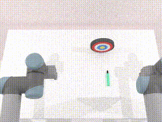<br><sub>Moving target only.</sub></div> | <div align="center">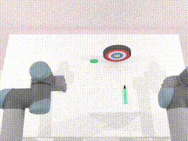<br><sub>Static green blocker.</sub></div> | <div align="center">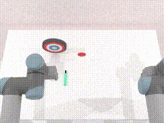<br><sub>Dynamic red blocker.</sub></div> | <div align="center">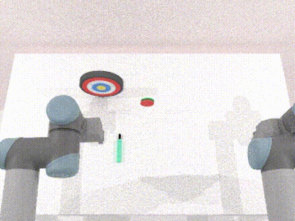<br><sub>Static green and dynamic red blockers.</sub></div> |
| **`load_train`**<br><sub>Drop a ball into an allowed wagon of a continuously circling toy train.</sub> | <div align="center">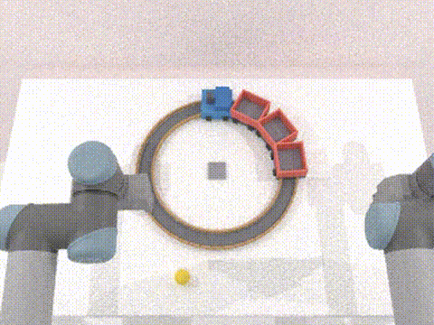<br><sub>Any of three red wagons is allowed.</sub></div> | <div align="center">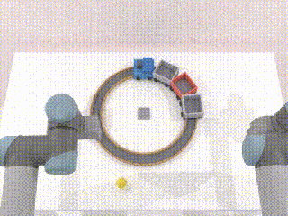<br><sub>Only the nominated red wagon is allowed.</sub></div> | <div align="center">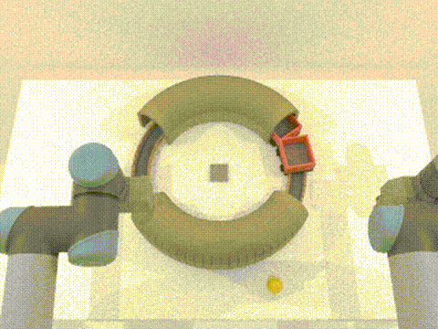<br><sub>Any wagon is allowed; matching far and near tunnels are present.</sub></div> | <div align="center">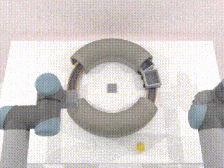<br><sub>Target wagon with matching far and near tunnels.</sub></div> |
| **`marble_shelf_maze`**<br><sub>Tilt shelves to route a marble through a zig-zag maze into the bowl.</sub> | <div align="center">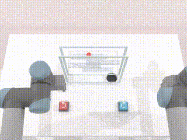<br><sub>Paused marble and stationary bowl.</sub></div> | <div align="center"><br><sub>Continuously moving marble.</sub></div> | <div align="center">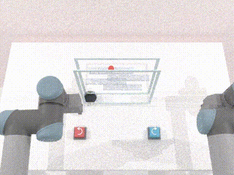<br><sub>Paused marble and oscillating bowl.</sub></div> | <div align="center">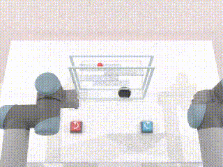<br><sub>Continuous marble motion and an oscillating bowl.</sub></div> |
| **`pack_fruits`**<br><sub>Pack red and green apples from belts into their matching baskets.</sub> | <div align="center">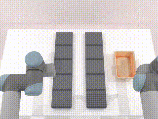<br><sub>Single color; one basket; apples on either belt.</sub></div> | <div align="center">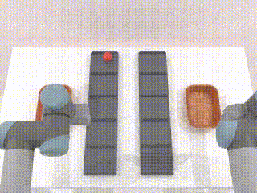<br><sub>Red and green with both baskets; one colored apple at a time.</sub></div> | <div align="center"><br><sub>Single color with black distractor apple(s).</sub></div> | <div align="center"><br><sub>Two colors with black distractor apple(s).</sub></div> |
| **`pick_ripe_apple`**<br><sub>Pick the good apple and place it in the basket while ignoring spoiled fruit.</sub> | <div align="center">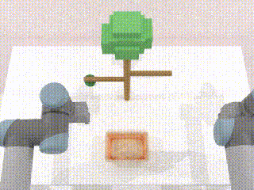<br><sub>One good apple; static basket.</sub></div> | <div align="center">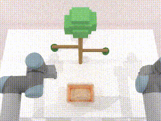<br><sub>Good and spoiled apples; static basket.</sub></div> | <div align="center">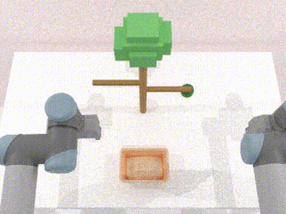<br><sub>One good apple; oscillating basket.</sub></div> | <div align="center"><br><sub>Good and spoiled apples with an oscillating basket.</sub></div> |
| **`place_block_belt`**<br><sub>Place a top-heavy block onto a belt so it rides upright into the exit bowl.</sub> | <div align="center"><br><sub>Fixed bowl; clear belt lane.</sub></div> | <div align="center"><br><sub>Moving bowl; clear belt lane.</sub></div> | <div align="center"><br><sub>Fixed bowl with a belt blocker.</sub></div> | <div align="center"><br><sub>Moving bowl with a belt blocker.</sub></div> |
| **`play_billiard`**<br><sub>Strike the red ball into an allowed pocket without robot contact.</sub> | <div align="center"><br><sub>Red ball only; any pocket is allowed.</sub></div> | <div align="center"><br><sub>Nominated target pocket.</sub></div> | <div align="center"><br><sub>Distractor balls; any pocket is allowed.</sub></div> | <div align="center"><br><sub>Nominated open pocket with distractors.</sub></div> |
| **`control_quality`**<br><sub>Stamp red and green tiles while skipping black outliers.</sub> | <div align="center"><br><sub>Alternating red and green tiles.</sub></div> | <div align="center"><br><sub>Random red and green tile order.</sub></div> | <div align="center"><br><sub>Alternating tiles with black outliers.</sub></div> | <div align="center"><br><sub>Random tile order with black outliers.</sub></div> |
| **`drop_ball_hole`**<br><sub>Guide a ball through the target hole of a rotating cubic or circular sorter into the container below.</sub> | <div align="center"><br><sub>Regular surface; target hole only.</sub></div> | <div align="center"><br><sub>Sticky surface; target hole only.</sub></div> | <div align="center"><br><sub>Regular surface with a dummy hole.</sub></div> | <div align="center"><br><sub>Sticky surface with a dummy hole.</sub></div> |
| **`sort_apples_belt`**<br><sub>Sort moving red and green apples into matching bins, sending rotten apples to the garbage dump.</sub> | <div align="center"><br><sub>Alternating colors; no rotten apple.</sub></div> | <div align="center"><br><sub>Random colors; no rotten apple.</sub></div> | <div align="center"><br><sub>Alternating colors with one rotten apple.</sub></div> | <div align="center"><br><sub>Random colors with one rotten apple.</sub></div> |
| **`whack_moles`**<br><sub>Whack both randomized-speed moles from above without touching a rabbit.</sub> | <div align="center"><br><sub>Two moles bob in fixed holes; no rabbit.</sub></div> | <div align="center"><br><sub>Fixed-hole moles with one rabbit distractor.</sub></div> | <div align="center"><br><sub>Unhit moles relocate after falling; no rabbit.</sub></div> | <div align="center"><br><sub>Relocating moles with one rabbit distractor.</sub></div> |


## Household Tasks

Household scenes in office / kitchen environments. Each task has one representative head-camera demo; two tasks share a row.

| Task | Demo | Task | Demo |
|---|---|---|---|
| **`trap_bug`**<br><sub>Trap a scurrying bug under the bookshelf with a glass box.</sub> | <div align="center"><br><sub>Success</sub></div> | **`catch_cup`**<br><sub>Push a pillow under a tipping mug so it lands softly.</sub> | <div align="center"><br><sub>Success</sub></div> |
| **`catch_mouse_object_drop`**<br><sub>Catch a shelf object knocked by a mouse with a pillow-lined basket.</sub> | <div align="center"><br><sub>Success</sub></div> | **`stop_ball`**<br><sub>Block a falling table-tennis ball before it rolls off the table.</sub> | <div align="center"><br><sub>Success</sub></div> |
| **`clean_table`**<br><sub>Wipe a spreading coffee spill before it reaches a laptop.</sub> | <div align="center"><br><sub>Success</sub></div> | **`fill_coffee_jar`**<br><sub>Press the dispenser lid to fill a jar to the target line.</sub> | <div align="center"><br><sub>Success</sub></div> |
| **`pour_beer`**<br><sub>Pour beer to the line; foam ramps while held. Overflow fails.</sub> | <div align="center"><br><sub>Success</sub></div> | **`boil_milk`**<br><sub>Heat milk, then shut the stove off before it overflows.</sub> | <div align="center"><br><sub>Success</sub></div> |
| **`cook_food`**<br><sub>Drop food into a lit pan; shut off at the target doneness.</sub> | <div align="center"><br><sub>Success</sub></div> | **`cook_food_timer`**<br><sub>Same as cook_food, with a pie timer while the stove is on.</sub> | <div align="center"><br><sub>Success</sub></div> |
| **`make_soup`**<br><sub>Tip board vegetables into a pot on an already-lit stove.</sub> | <div align="center"><br><sub>Success</sub></div> | **`measure_ingredient`**<br><sub>Fill a marked jar under an oil nozzle to the target ring.</sub> | <div align="center"><br><sub>Success</sub></div> |

## Acknowledgement

RoboDyna builds on [RoboTwin 2.0](https://github.com/RoboTwin-Platform/RoboTwin), [DOMINO](https://github.com/h-embodvis/DOMINO), and [SAPIEN](https://github.com/haosulab/SAPIEN).
