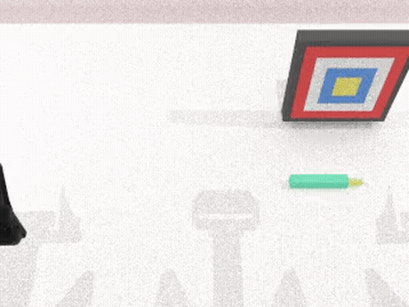

# 🦕 RoboDyna

Author: Rui Heng Yang

A dynamic **dual-arm** robotic-manipulation benchmark. All tasks run on the dual-UR5 (`ur5-wsg`)
embodiment, standardize on **SAPIEN 3.0.3**, and export to HDF5 + LeRobot v2.1.

## ⚙️ Simulator: SAPIEN 3.0.3 (required)

We standardize on **SAPIEN 3.0.3** for *both* data collection and evaluation. **Do not mix SAPIEN
versions** across data-gen and eval — different render shaders and PhysX defaults cause a
vision-policy distribution shift.

**Install:**
```bash
bash script/_install.sh
bash script/_download_assets.sh
```

**x86_64** (e.g. RTX 5080):
```bash
pip install sapien==3.0.3
```

**Run data collection** (env vars are required):
```bash
export VK_ICD_FILENAMES=/usr/share/vulkan/icd.d/nvidia_icd.json
unset DISPLAY
bash collect_data.sh <task> <task_config> 0
```
Output: per-episode HDF5 + mp4 under `data/<task>/<config>/`, plus an inline LeRobot v2.1 dataset
under `data_lerobot/`. (`data/`, `data_lerobot/`, `logs/` and most assets are gitignored.)

## 📋 Tasks

| Task | Description | Status | Demo |
|------|-------------|:------:|------|
| **cook_meat** | Grasp a raw steak, cook it on the pan until it reaches a randomized target doneness, then remove it. Time-evolving rendered object state. | ✅ **done** |  |
| **catch_ramp_ball** | A ball rolls down a ramp and off the front edge; the arm predicts the landing point and pre-positions a cup to catch it. | ✅ **done** |  |
| **sort_apples_belt** | 4–10 red/green apples stream down a conveyor (2–3 in flight); press the matching side button to aim a pivoting-blade diverter that routes each into its color-matched basket. Button physically drives the diverter (policy-evaluable). | ✅ **done** |  |
| **pick_ripe_apple** | Two apples ripen green→red→black **independently** on left/right boards; each arm observes its side and grasps at red (observe-then-act), dropping it into a bowl. Ripeness freezes once an apple leaves its board. | ✅ **done** |  |
| **stab_moving_target** | A concentric-ring target sways across the table; the arm grasps a dart, leads the target's motion, and drives the dart tip into the bullseye. | 🚧 **in progress** |  |

> ✅ **done** = 100-episode production dataset collected & verified end-to-end.
> 🚧 **in progress** = task built and running; tuning / validation ongoing.

### 🔬 Prototype tasks

Built and runnable on the dual-UR5 setup, but **not yet tuned/validated** to production quality (no
demo dataset or demo clip yet):

| Task | Description | Demo (partial) |
|------|-------------|----------------|
| `toast_bread` | Pick a bread slice, place it on the toaster/steamer, let a per-step timer brown it (pale → golden → brown → burnt), and remove it at a target level. |  |
| `place_block_belt` | Set a tall, top-heavy block onto a moving conveyor so it rides to the far end without tipping over. |  |
| `rotating_shape_sorter` | Drop three prisms (rectangular / triangular / cylindrical) into their matching holes on a continuously rotating sorter cap. |  |
| `two_type_sorting_catch` | Dual-arm catch: two interleaved object types fall along left/right-biased curves; sort each to its side. |  |
| `catch_rat` | Whack-a-mole: strike "rats" popping from a grid of holes spanning both arms' zones. |  |
| `collect_falling_bowl` | Catch spheres falling along curved (gravity + lateral) trajectories into a bowl. |  |
| `catch_marbles_trapdoors` | Time button presses to drop marbles through trapdoors on four belts as they pass the drop point. |  |
| `cup_curtain_slot` | Single-arm: carry a cup through a laterally swaying curtain of strips and into a slot. |  |
| `dual_hole_punch` | Both arms press buttons to hole-punch files on two independent belts simultaneously. |  |
| `pick_cup_behind_fan` | Retrieve a water-filled cup from behind a spinning 3-blade fan without hitting the blades or spilling. |  |
| `assemble_markers_cylinder` | Dual-arm assembly: attach four markers evenly (90° apart) around a vertical magnetic cylinder. |  |
| `stamp_moving_files` | Press a button to stamp file-boxes as they pass under a fixed gantry on a conveyor. |  |

## 🛠️ Adding a task

Tasks are intentionally **lightweight to add** — a new task touches only a handful of files and plugs
into the **existing shared config** rather than introducing its own.

**Minimal files per task** (the collector finds a task by filename — `file name == class name == CLI
arg`, no registry):

- `envs/<task>.py` — the task class (`load_actors`, `play_once`, `check_success`, + optional
  `_update_kinematic_tasks` for time-evolving state).
- `description/task_instruction/<task>.json` — language templates with `{A}`/`{B}`/`{a}` placeholders
  filled by `play_once` via `self.info["info"]`.
- `assets/objects/<id>_<name>/` — **only if** a new object is needed (see below).

**Use the shared config — do _not_ create a per-task config.** Every task reads its parameters from a
namespaced `task_args.<task>` block inside the two shared configs
`task_config/demo_dynamic.yml` (production) and `task_config/debug_dynamic.yml` (debug), read
defensively in `setup_demo`:

```yaml
# task_config/demo_dynamic.yml  (and debug_dynamic.yml)
task_args:
  my_task: { param_a: 1.0, param_b: 0.5 }
```
```python
cfg = kwags.get("task_args", {}).get("my_task", {})
self.param_a = cfg.get("param_a", DEFAULT_A)
```
Collect with `bash collect_data.sh <task> demo_dynamic 0` (or `debug_dynamic` for a small,
`save_failed_cases` run that always terminates while tuning).

### Assets

Objects live in `assets/objects/<NNN_name>/` with `visual/base<id>.glb`, `collision/base<id>.glb`, a
per-variant `model_data<id>.json` (grasp/placement points + scale), and `points_info.json`.

- **Reuse first.** Spawn an annotated asset directly:
  `create_actor(self, pose, modelname="220_apple_plain", model_id=0, convex=True)`.
- **Resize per-spawn, never edit a shared asset.** Pass `scale_mult` to `create_actor` — a float
  (uniform) or a 3-sequence (per-axis) load-time multiplier that also scales the contact/functional
  points (the asset file is untouched, so other tasks still get stock size). Plain `scale=` is ignored.
- **New object?** Source a **CC0** mesh (Poly Pizza / Sketchfab CC0) and integrate it with the bundled
  `integrate_object.py` (bakes scene-graph transforms, optionally strips the texture so `base_color`
  can tint it, scales to a real-world size, writes `model_data0.json` + `points_info.json` + a
  `NOTICE`). **New object ids start at ≥ 200.** Validate with `validate_asset.py` before writing task
  code (renders at the authored scale; catches a wrong scale early).
- Examples in this repo: `220_apple_plain` (reused for the conveyor apples + references — tracked),
  `200_steak` (CC0, texture stripped so `base_color` drives the cooking color), `202_bread_toast`,
  plus stock `106_skillet` / `110_basket`.
- ⚠️ `assets/*` is **gitignored** (large binaries), so custom meshes are **not** in this repo — a
  clean clone needs a separate asset drop to be fully runnable.

### 🤖 Bundled Claude Code skill: `SAPIEN-task-creator`

This repo ships a [Claude Code](https://claude.com/claude-code) skill that automates the whole
process above at `.claude/skills/SAPIEN-task-creator/`:

```
.claude/skills/SAPIEN-task-creator/
├── SKILL.md                              # the end-to-end task-authoring process
├── scripts/integrate_object.py           # CC0 GLB -> benchmark object (transforms, scale, model_data)
├── scripts/validate_asset.py             # offscreen-render an asset at its authored scale
└── references/                           # task anatomy & API, asset/property schema, cook_meat walkthrough
```

Open the repo in Claude Code and ask to *"add a task"*, *"create a &lt;…&gt; task"*, or *"add an
object"* — it routes through the skill, which encodes the task lifecycle, motion primitives, the
two-pass collector's non-obvious pitfalls (per-arm reachability, `place_actor` constraints,
`_update_kinematic_tasks` init-order crash, infinite-retry guards), and asset sourcing/integration.
