# 🦕 RoboDyna

A dynamic **dual-arm** robotic-manipulation benchmark, forked and extended from
[DOMINO](https://github.com/h-embodvis/DOMINO) (RoboTwin 2.0 + SAPIEN + curobo). All tasks run on the
dual-UR5 (`ur5-wsg`) embodiment, standardize on **SAPIEN 3.0.3**, and export to HDF5 + LeRobot v2.1.

## ⚙️ Simulator: SAPIEN 3.0.3 (required)

We standardize on **SAPIEN 3.0.3** for *both* data collection and evaluation. **Do not mix SAPIEN
versions** across data-gen and eval — different render shaders and PhysX defaults cause a
vision-policy distribution shift. (Upstream pins `3.0.0b1`, which predates aarch64 and has no arm64
wheel; 3.0.3 is the only release with wheels for both x86_64 and aarch64.)

**x86_64** (e.g. RTX 5080):
```bash
pip install sapien==3.0.3
```

**aarch64** (NVIDIA GB10 / Jetson) — use the official aarch64 wheel from the haosulab release:
```bash
pip install https://github.com/haosulab/SAPIEN/releases/download/3.0.3/sapien-3.0.3-cp310-cp310-linux_aarch64.whl
```
Two aarch64-only fixes are needed (automated in `build_domino_aarch64.sh`):
- **librt ABI fix** (glibc 2.39): symlink the vendored `…/sapien.libs/librt-*.so` →
  `/lib/aarch64-linux-gnu/librt.so.1`.
- **import order**: `import open3d` **before** `import sapien`, or the renderer segfaults — a
  `sitecustomize.py` that preloads open3d handles this transparently.

**Run data collection** (env vars are required):
```bash
export VK_ICD_FILENAMES=/usr/share/vulkan/icd.d/nvidia_icd.json
unset DISPLAY
bash collect_data.sh <task> <task_config> 0
```
Output: per-episode HDF5 + mp4 under `data/<task>/<config>/`, plus an inline LeRobot v2.1 dataset
under `data_lerobot/`. (`data/`, `data_lerobot/`, `logs/` and most assets are gitignored.)

## 📋 Tasks

| Task | Description | Status | Demo |
|------|-------------|:------:|------|
| **cook_meat** | Grasp a raw steak, cook it on the pan until it reaches a randomized target doneness, then remove it. Time-evolving rendered object state. | ✅ **done** | 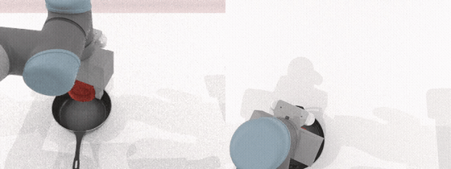 |
| **catch_ramp_ball** | A ball rolls down a ramp and off the front edge; the arm predicts the landing point and pre-positions a cup to catch it. | ✅ **done** | 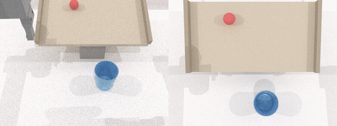 |
| **sort_apples_belt** | 4–10 red/green apples stream down a conveyor (2–3 in flight); press the matching side button to aim a pivoting-blade diverter that routes each into its color-matched basket. Button physically drives the diverter (policy-evaluable). | ✅ **done** | 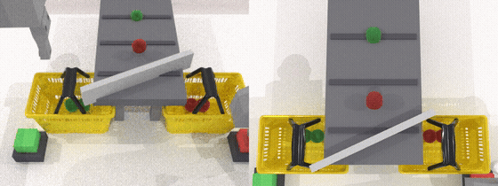 |
| **pick_ripe_apple** | Two apples ripen green→red→black **independently** on left/right boards; each arm observes its side and grasps at red (observe-then-act), dropping it into a bowl. Ripeness freezes once an apple leaves its board. | ✅ **done** | 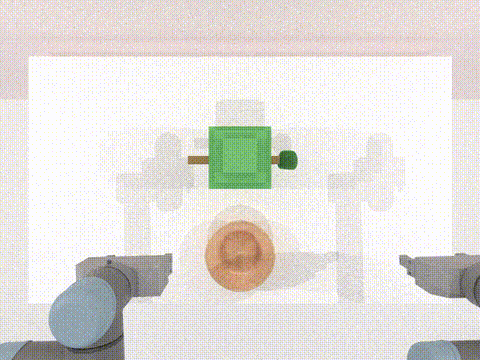 |
| **hit_target** | A moving target sways across the table; the arm grasps a dart, leads the motion, and attaches the dart inside the yellow center square. | 🚧 **in progress** | 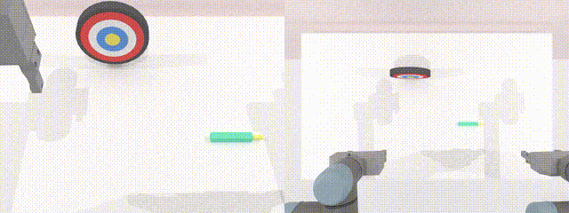 |

> ✅ **done** = 100-episode production dataset collected & verified end-to-end.
> 🚧 **in progress** = task built and running; tuning / validation ongoing.

### 🔬 Prototype tasks

Built and runnable on the dual-UR5 setup, but **not yet tuned/validated** to production quality (no
demo dataset or demo clip yet):

| Task | Description | Demo (partial) |
|------|-------------|----------------|
| `toast_bread` | Pick a bread slice, place it on the toaster/steamer, let a per-step timer brown it (pale → golden → brown → burnt), and remove it at a target level. | 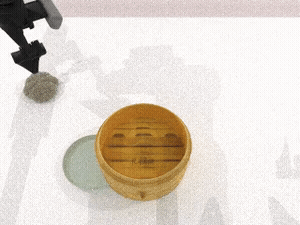 |
| `place_block_belt` | Set a tall, top-heavy block onto a moving conveyor so it rides to the far end without tipping over. | 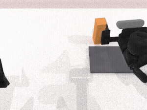 |
| `rotating_shape_sorter` | Drop three prisms (rectangular / triangular / cylindrical) into their matching holes on a continuously rotating sorter cap. | 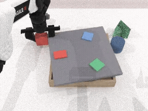 |
| `two_type_sorting_catch` | Dual-arm catch: two interleaved object types fall along left/right-biased curves; sort each to its side. | 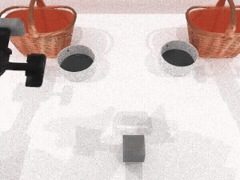 |
| `catch_rat` | Whack-a-mole: strike "rats" popping from a grid of holes spanning both arms' zones. | 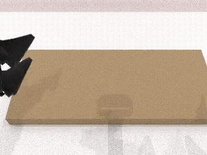 |
| `collect_falling_bowl` | Catch spheres falling along curved (gravity + lateral) trajectories into a bowl. | 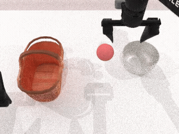 |
| `catch_marbles_trapdoors` | Time button presses to drop marbles through trapdoors on four belts as they pass the drop point. | 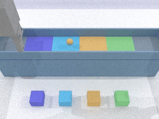 |
| `cup_curtain_slot` | Single-arm: carry a cup through a laterally swaying curtain of strips and into a slot. | 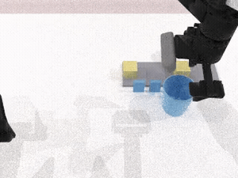 |
| `dual_hole_punch` | Both arms press buttons to hole-punch files on two independent belts simultaneously. | 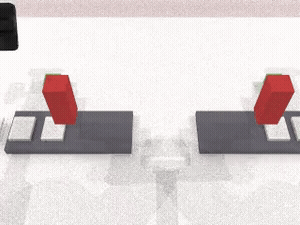 |
| `pick_cup_behind_fan` | Retrieve a water-filled cup from behind a spinning 3-blade fan without hitting the blades or spilling. | 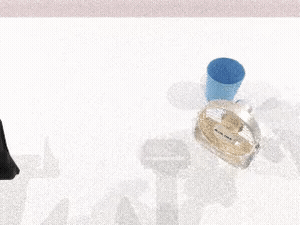 |
| `assemble_markers_cylinder` | Dual-arm assembly: attach four markers evenly (90° apart) around a vertical magnetic cylinder. | 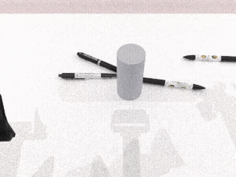 |
| `stamp_moving_files` | Press a button to stamp file-boxes as they pass under a fixed gantry on a conveyor. | 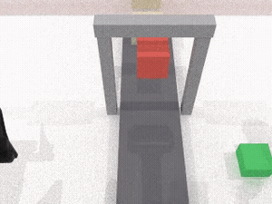 |

## 🛠️ Adding a task

Tasks are intentionally **lightweight to add** — a new task touches only a handful of files and plugs
into the **existing shared config** rather than introducing its own.

**Minimal files per task** (the collector finds a task by filename — `file name == class name == CLI
arg`, no registry):

- `envs/<task>.py` — the task class (`load_actors`, `play_once`, `check_success`, + optional
  `_update_kinematic_tasks` for time-evolving state).
- `description/task_instruction/<task>.json` — language templates with `{A}`/`{B}`/`{a}` placeholders
  filled by `play_once` via `self.info["info"]`.
- `assets/objects/<id>_<name>/` — **only if** a new object is needed (see below).

**Use the shared config — do _not_ create a per-task config.** Every task reads its parameters from a
namespaced `task_args.<task>` block inside the two shared configs
`task_config/demo_dynamic.yml` (production) and `task_config/debug_dynamic.yml` (debug), read
defensively in `setup_demo`:

```yaml
# task_config/demo_dynamic.yml  (and debug_dynamic.yml)
task_args:
  my_task: { param_a: 1.0, param_b: 0.5 }
```
```python
cfg = kwags.get("task_args", {}).get("my_task", {})
self.param_a = cfg.get("param_a", DEFAULT_A)
```
Collect with `bash collect_data.sh <task> demo_dynamic 0` (or `debug_dynamic` for a small,
`save_failed_cases` run that always terminates while tuning).

### Assets

Objects live in `assets/objects/<NNN_name>/` with `visual/base<id>.glb`, `collision/base<id>.glb`, a
per-variant `model_data<id>.json` (grasp/placement points + scale), and `points_info.json`.

- **Reuse first.** Spawn an annotated asset directly:
  `create_actor(self, pose, modelname="220_apple_plain", model_id=0, convex=True)`.
- **Resize per-spawn, never edit a shared asset.** Pass `scale_mult` to `create_actor` — a float
  (uniform) or a 3-sequence (per-axis) load-time multiplier that also scales the contact/functional
  points (the asset file is untouched, so other tasks still get stock size). Plain `scale=` is ignored.
- **New object?** Source a **CC0** mesh (Poly Pizza / Sketchfab CC0) and integrate it with the bundled
  `integrate_object.py` (bakes scene-graph transforms, optionally strips the texture so `base_color`
  can tint it, scales to a real-world size, writes `model_data0.json` + `points_info.json` + a
  `NOTICE`). **New object ids start at ≥ 200.** Validate with `validate_asset.py` before writing task
  code (renders at the authored scale; catches a wrong scale early).
- Examples in this repo: `220_apple_plain` (reused for the conveyor apples + references — tracked),
  `200_steak` (CC0, texture stripped so `base_color` drives the cooking color), `202_bread_toast`,
  plus stock `106_skillet` / `110_basket`.
- ⚠️ `assets/*` is **gitignored** (large binaries), so custom meshes are **not** in this repo — a
  clean clone needs a separate asset drop to be fully runnable.

### 🤖 Bundled Claude Code skill: `SAPIEN-task-creator`

This repo ships a [Claude Code](https://claude.com/claude-code) skill that automates the whole
process above at `.claude/skills/SAPIEN-task-creator/`:

```
.claude/skills/SAPIEN-task-creator/
├── SKILL.md                              # the end-to-end task-authoring process
├── scripts/integrate_object.py           # CC0 GLB -> benchmark object (transforms, scale, model_data)
├── scripts/validate_asset.py             # offscreen-render an asset at its authored scale
└── references/                           # task anatomy & API, asset/property schema, cook_meat walkthrough
```

Open the repo in Claude Code and ask to *"add a task"*, *"create a &lt;…&gt; task"*, or *"add an
object"* — it routes through the skill, which encodes the task lifecycle, motion primitives, the
two-pass collector's non-obvious pitfalls (per-arm reachability, `place_actor` constraints,
`_update_kinematic_tasks` init-order crash, infinite-retry guards), and asset sourcing/integration.

---

> _The upstream DOMINO / PUMA documentation follows._

<h2 align="center"> Towards Generalizable Robotic Manipulation in Dynamic Environments </h2>

<div align="center">
    <a href="https://arxiv.org/abs/2603.15620"></a>
    <a href="https://h-embodvis.github.io/DOMINO/"></a>
    <a href="https://huggingface.co/datasets/h-embodvis/DOMINO"></a>
    <a href="https://huggingface.co/H-EmbodVis/PUMA"></a>
    <a href="https://www.modelscope.cn/datasets/H-EmbodVis/DOMINO"></a>
    <a href="https://opensource.org/licenses/Apache-2.0"></a>

<h5 align="center"><em>Heng Fang<sup>1</sup>, Shangru Li<sup>1</sup>, Shuhan Wang<sup>1</sup>, Xuanyang Xi<sup>2</sup>, Dingkang Liang<sup>1</sup>, Xiang Bai<sup>1</sup> </em></h5>
<sup>1</sup> Huazhong University of Science and Technology, <sup>2</sup> Huawei Technologies Co. Ltd 
</div>


## 🔍 Overview

Dynamic manipulation requires robots to continuously adapt to moving objects and unpredictable environmental changes. Existing Vision-Language-Action (VLA) models rely on static single-frame observations, failing to capture essential spatiotemporal dynamics. We introduce **DOMINO**, a comprehensive benchmark for this underexplored frontier, and **PUMA**, a predictive architecture that couples historical motion cues with future state anticipation to achieve highly reactive embodied intelligence.

<div  align="center">    
 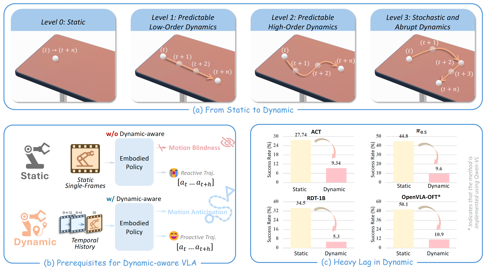
</div>

<details>
  <summary>Abstract
  </summary>

Vision-Language-Action (VLA) models excel in static manipulation but struggle in dynamic environments with moving targets. This performance gap primarily stems from a scarcity of dynamic manipulation datasets and the reliance of mainstream VLAs on single-frame observations, restricting their spatiotemporal reasoning capabilities. To address this, we introduce DOMINO, a large-scale dataset and benchmark for generalizable dynamic manipulation, featuring 35 tasks with hierarchical complexities, over 110K expert trajectories, and a multi-dimensional evaluation suite. Through comprehensive experiments, we systematically evaluate existing VLAs on dynamic tasks, explore effective training strategies for dynamic awareness, and validate the generalizability of dynamic data. Furthermore, we propose PUMA, a dynamics-aware VLA architecture. By integrating scene-centric historical optical flow and specialized world queries to implicitly forecast object-centric future states, PUMA couples history-aware perception with short-horizon prediction. Results demonstrate that PUMA achieves state-of-the-art performance, yielding a 6.3% absolute improvement in success rate over baselines. Moreover, we show that training on dynamic data fosters robust spatiotemporal representations that transfer to static tasks.
</details>


### 📰 News

**[2026/05/29]** 🙏 Special thanks to the [Qwen team](https://github.com/QwenLM) for using DOMINO in [Qwen-VLA](https://arxiv.org/abs/2605.30280) as a **dynamic manipulation OOD benchmark**! We welcome everyone to try DOMINO for evaluating VLA robustness.

**[2026/04/22]** 🔥 DOMINO now supports the [StarVLA](https://github.com/starVLA/starVLA) codebase! Evaluation code is available [here](https://github.com/starVLA/starVLA/tree/starVLA_dev/examples/DOMINO).

**[2026/03/30]** 🚀 We now release the PUMA training/evaluation code and the [PUMA checkpoint](https://huggingface.co/H-EmbodVis/PUMA).

**[2026/03/28]** 🔥 The DOMINO dataset is now available on [Hugging Face](https://huggingface.co/datasets/h-embodvis/DOMINO) and [ModelScope](https://www.modelscope.cn/datasets/H-EmbodVis/DOMINO).

**[2026/03/24]** 🚀 We release the DOMINO benchmark code, including setup, data collection, and policy evaluation instructions.

**[2026/03/17]** 🎉 We release the [paper](https://arxiv.org/abs/2603.15620), [project homepage](https://h-embodvis.github.io/DOMINO/), and visual demos.


### 🎥 Visual Demos

More visual demos can be found on our [project homepage](https://h-embodvis.github.io/DOMINO/).

<div align="center">
  
  
  
</div>
<div align="center">
  
  
  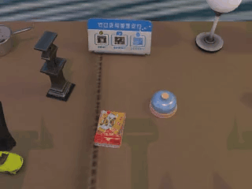
</div>

### ✨ Key Idea

* Current VLA models struggle with dynamic manipulation tasks due to a scarcity of dynamic datasets and a reliance on single-frame observations.
* We introduce DOMINO, a large-scale benchmark for dynamic manipulation comprising 35 tasks and over 110K expert trajectories.
* We propose PUMA, a dynamics-aware VLA architecture that integrates historical optical flow and world queries to forecast future object states.
* Training on dynamic data fosters robust spatiotemporal representations, demonstrating enhanced generalization capabilities.


## 📅 TODO
* [x] Release the paper
* [x] Release DOMINO benchmark code
* [x] Release DOMINO dataset on [HuggingFace](https://huggingface.co/datasets/h-embodvis/DOMINO) and [ModelScope](https://www.modelscope.cn/datasets/H-EmbodVis/DOMINO)
* [x] Release PUMA training code and evaluation code
* [x] Release PUMA checkpoint on [HuggingFace](https://huggingface.co/H-EmbodVis/PUMA)
* [x] Support [StarVLA](https://github.com/starVLA/starVLA) codebase (evaluation code available [here](https://github.com/starVLA/starVLA/tree/starVLA_dev/examples/DOMINO))
* [ ] Add real-world evaluation results
* [ ] Support Huawei Ascend NPUs


## 🛠️ Getting Started

This project is divided into two main components that operate in separate environments and communicate via WebSockets:
- **DOMINO**: The simulation environment and data generation pipeline.
- **PUMA**: The Vision-Language-Action policy framework.

You will need to set up both environments to run the full pipeline.

### 1. DOMINO (Simulation & Data Pipeline)

#### 1.0. System Requirements
- **OS**: Linux (Windows/MacOS have limited or no support)
- **Hardware**: NVIDIA GPU (RTX recommended for ray tracing)
- **Software**: Python 3.10, CUDA 12.1 (Recommended), NVIDIA Driver >= 520

*Note: If running inside a Docker container, you must include the graphics capability to avoid Vulkan-related segmentation faults:*
```bash
docker run ... -e NVIDIA_DRIVER_CAPABILITIES=compute,utility,graphics
```

#### 1.1. Installation Steps

**Step 1: Install System Dependencies**
Ensure Vulkan and FFmpeg are installed on your system:
```bash
sudo apt update
sudo apt install libvulkan1 mesa-vulkan-drivers vulkan-tools ffmpeg
```
*(Verify installations by running `vulkaninfo` and `ffmpeg -version`)*

**Step 2: Create Conda Environment**
```bash
conda create -n domino python=3.10 -y
conda activate domino
```

**Step 3: Clone and Install**
```bash
git clone https://github.com/h-embodvis/DOMINO.git
cd DOMINO

# Install basic environments and CuRobo
bash script/_install.sh
```
*Troubleshooting: If you encounter a CuRobo config path issue, run `python script/update_embodiment_config_path.py`. A failed PyTorch3D installation won't affect core functionality unless you are using 3D data.*

**Step 4: Download Assets**
Download the required assets (RoboTwin-OD, Texture Library, and Embodiments). If you hit rate limits, log in to Hugging Face first (`huggingface-cli login`).
```bash
bash script/_download_assets.sh
```

#### 1.2. Data Collection

We provide an automated pipeline for data collection. You can collect data by running:

```bash
bash collect_data.sh ${task_name} ${task_config} ${gpu_id}
# Example: bash collect_data.sh adjust_bottle demo_clean_dynamic 0
```

After collection, the data will be stored under `data/${task_name}/${task_config}` in **HDF5 format**. For the full data collection process and common issues, please refer to the [RoboTwin Data Collection Tutorial](https://robotwin-platform.github.io/doc/usage/collect-data.html).

**Dynamic Task Configurations**

To enable dynamic environments, we introduce four specific configurations in the task config files (e.g., `task_config/demo_clean_dynamic.yml` and `task_config/demo_random_dynamic.yml`):

<details>
<summary><b>Click to view Dynamic Configurations</b></summary>

- `use_dynamic` (bool): Whether to enable dynamic motion in the environment (e.g., moving objects).
- `dynamic_level` (int): The complexity level of the dynamic motion (1, 2, or 3). Higher levels introduce more challenging dynamic behaviors.
- `dynamic_coefficient` (float): A scaling factor (default: 0.1) that controls the speed of the dynamic movements.
- `check_render_success` (bool): Whether to verify rendering success during data collection, ensuring that dynamic interactions do not cause visual or physical glitches.

</details>

For all other detailed configurations (like domain randomization, cameras, and data types), we maintain the original RoboTwin 2.0 settings. You can find more information in the [RoboTwin Configurations Tutorial](https://robotwin-platform.github.io/doc/usage/configurations.html).

#### 1.3. Policy Evaluation

To evaluate a trained policy, use the following command. The `task_config` field refers to the evaluation environment configuration, while the `ckpt_setting` field refers to the training data configuration used during policy learning.

```bash
bash eval.sh ${task_name} ${task_config} ${ckpt_setting} ${expert_data_num} ${seed} ${gpu_id}

# Example: Evaluate a policy trained on `demo_clean_dynamic` and tested on `demo_clean_dynamic`
# bash eval.sh adjust_bottle demo_clean_dynamic demo_clean_dynamic 50 0 0
```

<details>
<summary><b>Click to view Dynamic Adaptations in Evaluation</b></summary>

To better evaluate dynamic manipulation, we have introduced several modifications in `script/eval_policy.py` and `script/eval_metrics.py`:

- **Enhanced Evaluation Metrics**: Alongside the standard Success Rate (SR), we introduce the **Manipulation Score (MS)**, a comprehensive metric that evaluates route completion while applying penalties for undesirable behaviors (e.g., collisions or out-of-bounds).
- **Strict Success Conditions**: We added rigorous success criteria for dynamic objects, including **out-of-bounds detection** (failing if the object leaves the workspace before grasping) and **lifting verification** (ensuring the object is lifted beyond a specific height threshold to prevent false positives from accidental touches).

</details>

**Note**: The policy evaluation framework is fully compatible with **RoboTwin 2.0**. You can seamlessly migrate and evaluate any policies between the two repositories by simply loading a new task configuration within our codebase. 

### 2. PUMA (VLA Policy)

> More details about the PUMA architecture can be found in the [PUMA README](policy/PUMA/README.md).

PUMA is a predictive VLA architecture that couples historical motion cues with future state anticipation to achieve highly reactive embodied intelligence.

#### 2.1 Installation Steps

The codebase is provided in `policy/PUMA`. Please set up the environment from this directory.

**Step 1: Create Conda Environment**
```bash
conda create -n puma python=3.10 -y
conda activate puma
```

**Step 2: Install Dependencies and PUMA**
Make sure to install a PyTorch version that matches your CUDA toolkit. We recommend CUDA 12.4.

```bash
# 1. Install PUMA Core Dependencies
cd policy/PUMA
pip install -r requirements.txt
pip install flash-attn==2.7.4.post1 --no-build-isolation

# 2. Install GroundingDINO for Grounded-SAM-2
cd PUMA/model/modules/grounding_sam/grounding_dino
pip install -r requirements.txt
pip install --no-build-isolation -e .
python setup.py build_ext --inplace
cd ..

# 3. Install SAM2
pip install --no-build-isolation -e .
cd ../../../..

# 4. Install PUMA Package
pip install -e .
```

<details close>
<summary><b>Common Issues (Flash-Attn)</b></summary>

`flash-attn` can be tricky to install because it must match your system’s CUDA toolkit (`nvcc`) and PyTorch versions. The `--no-build-isolation` flag resolves most issues, but on newer systems you may need to manually choose a compatible `flash-attn` version. Ensure your CUDA driver/toolkit and torch versions are aligned. Check your environment:

```bash
nvcc -V
pip list | grep -E 'torch|transformers|flash-attn'
```

If issues persist, pick a `flash-attn` release that matches your versions (CUDA and torch) or ask ChatGPT to help with the outputs above. We have verified that `flash-attn==2.7.4.post1` works well with nvcc versions `12.0` and `12.4`.
</details>

#### 2.2 Download Pre-trained Weights

PUMA requires both a Vision-Language-Action base model and grounding models (SAM2 + GroundingDINO). Please download the following weights and place them under `policy/PUMA/playground/Pretrained_models`.

1. **Base VLM Model**
   - Download the `Qwen3-VL-4B-Instruct-Action` base model from Hugging Face: [StarVLA/Qwen3-VL-4B-Instruct-Action](https://huggingface.co/StarVLA/Qwen3-VL-4B-Instruct-Action)
   - Place it at: `policy/PUMA/playground/Pretrained_models/Qwen3-VL-4B-Instruct-Action`

2. **Grounded-SAM-2 Models**
   - **SAM 2.1 Large**: Download `sam2.1_hiera_large.pt` from [Meta Segment Anything 2.1](https://dl.fbaipublicfiles.com/segment_anything_2/092824/sam2.1_hiera_large.pt)
   - **GroundingDINO Swin-T**: Download `groundingdino_swint_ogc.pth` from [IDEA-Research GroundingDINO](https://github.com/IDEA-Research/GroundingDINO/releases/download/v0.1.0-alpha/groundingdino_swint_ogc.pth)
   - Place all downloaded files at: `policy/PUMA/playground/Pretrained_models/grounded_sam2/`

<details close>
<summary><b>Click to view example directory structure</b></summary>
The resulting directory structure should look like this:

```text
policy/PUMA/playground/Pretrained_models/
├── Qwen3-VL-4B-Instruct-Action/
│   ├── config.json
│   ├── model.safetensors.index.json
│   └── ...
└── grounded_sam2/
    ├── groundingdino_swint_ogc.pth
    └── sam2.1_hiera_large.pt
```
</details>

#### 2.3 Training PUMA

We provide the main training launch script inside `policy/PUMA/scripts/run_scripts/run_lerobot_robotwin_puma.sh`.

1. Review and modify the environment variables in `scripts/run_scripts/run_lerobot_robotwin_puma.sh` (e.g., `DATA_ROOT_DIR`, `RUN_ROOT_DIR`) to match your system settings.
2. Launch the training:
```bash
cd policy/PUMA
bash scripts/run_scripts/run_lerobot_robotwin_puma.sh
```

#### 2.4 Evaluation

The evaluation involves communication between the `PUMA` policy server and the `DOMINO` simulation environment via WebSockets.

**Step 1: Start the PUMA Policy Server**
Open a new terminal, activate the `puma` environment, and launch the server:
```bash
conda activate puma
cd policy/PUMA
# Make sure to edit your checkpoint path in `examples/Robotwin/eval_files/deploy_policy.yml` and `run_policy_server.sh` first!
bash examples/Robotwin/eval_files/run_policy_server.sh
```

**Step 2: Start the DOMINO Simulation**
In another terminal, activate your simulation environment (`domino`) and launch the evaluation loop:
```bash
conda activate domino
cd policy/PUMA/examples/Robotwin/eval_files
# Example: Evaluate on adjust_bottle
bash eval.sh adjust_bottle demo_clean_dynamic puma_demo 0 0
```


## 👍 Acknowledgement

We build upon the following great works and open source repositories
* [RoboTwin 2.0](https://github.com/RoboTwin-Platform/RoboTwin)
* [starVLA](https://github.com/starVLA/starVLA)
* [Grounded-SAM-2](https://github.com/IDEA-Research/Grounded-SAM-2)
* [Qwen3-VL](https://github.com/QwenLM/Qwen3-VL/tree/main)
* [SAPIEN](https://github.com/haosulab/SAPIEN)


## 📖 Citation

```bibtex
@article{fang2026towards,
      title={Towards Generalizable Robotic Manipulation in Dynamic Environments},
      author={Fang, Heng and Li, Shangru and Wang, Shuhan and Xi, Xuanyang and Liang, Dingkang and Bai, Xiang},
      journal={arXiv preprint arXiv:2603.15620},
      year={2026}
}
```
