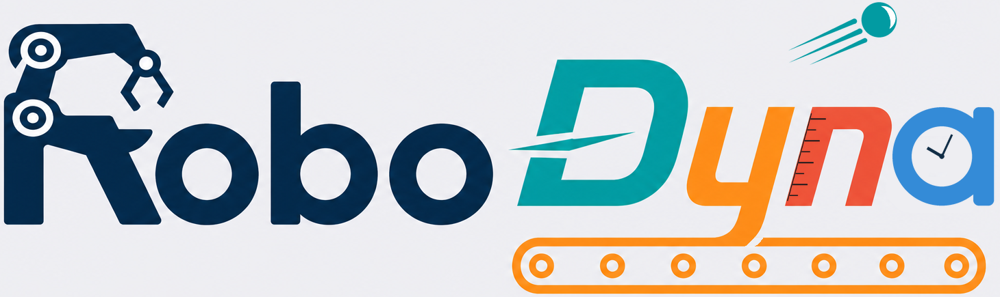

<div align="center">
  <a href="https://eai-rsm.github.io/RoboDyna/"></a>
  <p><a href="https://eai-rsm.github.io/RoboDyna/"><strong>Project page & task gallery</strong></a></p>
</div>

# RoboDyna

RoboDyna is a dual-arm robotic-manipulation benchmark for dynamic environments. Instead of static pick-and-place alone, tasks require timing, prediction, reactive control, and reasoning about changing physical state: objects move and fall, belts run, timers advance, food cooks, and distractors appear.

The benchmark contains 23 Base tabletop tasks with four conditions each (Default, Opt 1, Opt 2, and Opt 1+2), plus 12 Household office and kitchen tasks. It is built on [RoboTwin 2.0](https://github.com/RoboTwin-Platform/RoboTwin), DOMINO, and SAPIEN 3.0.3, with the dual-UR5 `ur5-wsg` embodiment.

## Project page

The [project page and task gallery](https://eai-rsm.github.io/RoboDyna/) contain every task demo. The interactive gallery covers all 104 Base conditions and all 12 Household tasks, so large media tables do not live in this README. It also links to [RoboDyna Arcade](https://eai-rsm.github.io/RoboDyna/arcade.html), a browser-native conceptual mini-game collection inspired by the benchmark.

## Quick start

Requirements: Linux, an NVIDIA GPU with a CUDA-capable driver, Python 3.10, Vulkan, and FFmpeg.

```bash
git clone https://github.com/EAI-RSM/RoboDyna.git
cd RoboDyna

# Creates the `robodyna` conda environment and installs SAPIEN, CuRobo, etc.
bash script/install_robodyna.sh
conda activate robodyna

# Downloads RoboTwin meshes, embodiments, and background textures.
bash script/_download_assets.sh
```

For headless collection or recording:

```bash
export VK_ICD_FILENAMES=/usr/share/vulkan/icd.d/nvidia_icd.json
unset DISPLAY
```

On aarch64 / GB10, use `scripts/build_domino_aarch64.sh` rather than the standard installer.

## Use RoboDyna

Launch the unified GUI to explore Base tasks, Household tasks, and human experiments:

```bash
conda activate robodyna
python interactive/robodyna_gui.py
```

To collect expert demonstrations:

```bash
# bash scripts/collect_data.sh <task> <task_config> <gpu_id> [scenario]
bash scripts/collect_data.sh cook_meat demo_dynamic 0 opt1
bash scripts/collect_data.sh boil_milk demo_dynamic 0
```

`demo_dynamic` is the production profile (50 successful episodes; head and wrist D435 cameras). `debug_dynamic` keeps short settings for iteration. Collected HDF5/video data is saved under `data/<task>/<scenario>/`; the associated LeRobot v2.1 export is saved under `data_lerobot/`.

## Repository guide

| Location | Purpose |
|---|---|
| `interactive/` | Base, Household, and human-experiment GUIs |
| `envs/` | Task environments, scoring, robots, and assets integration |
| `task_config/` | Shared collection settings, scenarios, seeds, and canonical task instructions |
| `script/` | Collection, evaluation, export, and benchmark utilities |
| `scripts/` | Shell and Slurm launchers |
| `policy/pi0/`, `policy/pi05/` | Supported policy integrations |
| `docs/` | Project page, logo, and published task media |

There is one fixed language instruction per task in [`task_config/task_instructions.json`](task_config/task_instructions.json). The GUI, policy evaluation, and LeRobot export use this shared catalog. [`task_config/eval_seeds.yml`](task_config/eval_seeds.yml) holds the fixed seeds shared by human experiments and policy evaluation.

For the complete collection corpus, [`task_config/manifest_collect.txt`](task_config/manifest_collect.txt) lists 23 Base tasks × 4 scenarios plus 12 Household tasks. `scripts/slurm/collect.sbatch` and `scripts/collection/collect_4080.sh` consume it directly.

## Acknowledgement

RoboDyna builds on [RoboTwin 2.0](https://github.com/RoboTwin-Platform/RoboTwin), [DOMINO](https://github.com/h-embodvis/DOMINO), and [SAPIEN](https://github.com/haosulab/SAPIEN).
