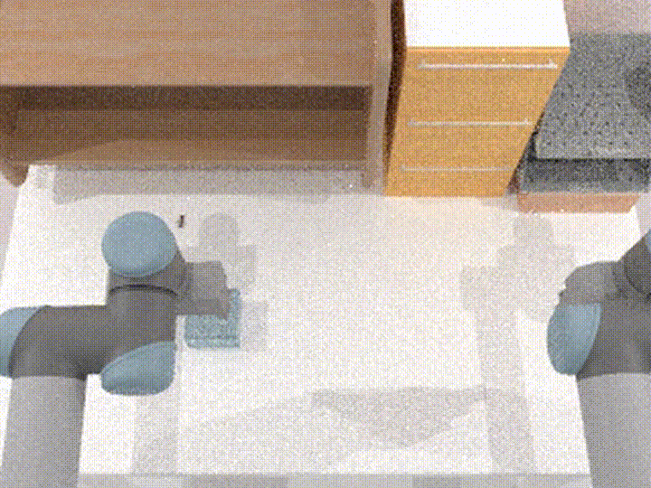
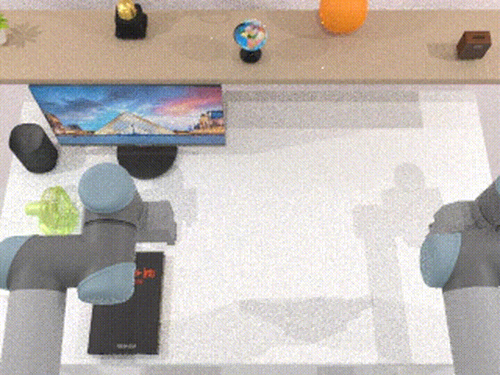
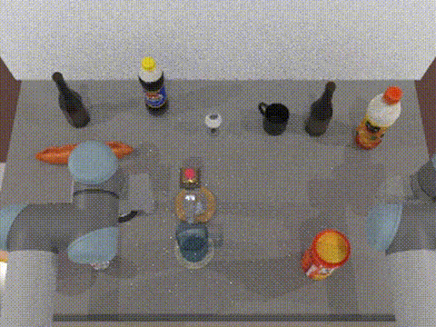
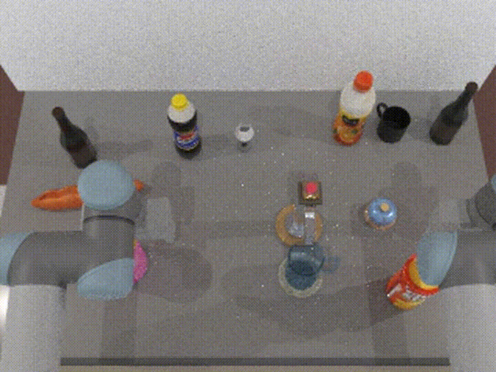
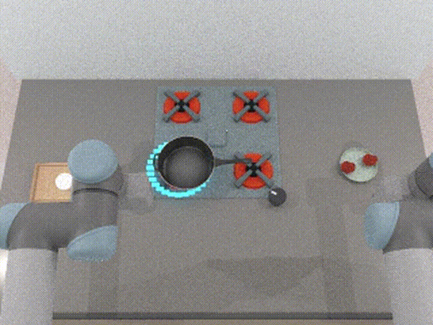
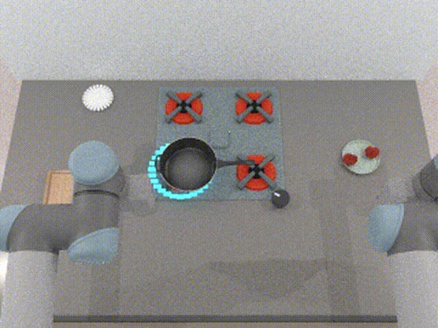
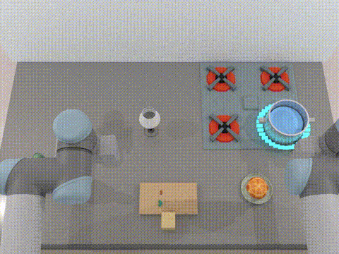

# Household interactive tasks

Launch the graphical household task selector with:

```bash
./script_hh_exp/household_task_gui.py
```

The selector shows the tasks as a vertically scrollable table. Each task has a
large preview (three times the original preview size) and its own Play/Stop
button over the lower edge of the image. Only one task viewer runs at a time;
when it closes, the selector remains open and reports SUCCESS, FAILURE, or
that the viewer was closed before a result, so another task can be launched.

## Demos

Each interactive scenario has a head-camera expert demo
under `final_task_demos/<task>/`. The GUI prefers the head-camera `scene_snapshot.png`
for the card preview, falling back to `default_sidebyside.gif`.

| Task | Demo |
|---|---|
| **`trap_bug`** |   |
| **`catch_cup`** |   |
| **`catch_mouse_object_drop`** |   |
| **`stop_ball`** |   |
| **`clean_table`** |   |
| **`fill_coffee_jar`** |   |
| **`pour_beer`** |   |
| **`boil_milk`** |   |
| **`cook_food`** |   |
| **`cook_food_timer`** |   |
| **`make_soup`** |   |
| **`measure_ingredient`** |   |


Refresh GUI head-camera card snapshots:

```bash
export VK_ICD_FILENAMES=/usr/share/vulkan/icd.d/nvidia_icd.json; unset DISPLAY
python script/bench_script/publish_gui_snapshots.py --household-only
```

Re-record household demos (head + top-down + side-by-side GIF):

```bash
export VK_ICD_FILENAMES=/usr/share/vulkan/icd.d/nvidia_icd.json; unset DISPLAY
python script/bench_script/publish_household_demos.py
```

Each script starts the corresponding environment in a SAPIEN viewer and uses
the same controls as the interactive examples in `script_exp`:

```text
--control robot (default): 1/2/3 selects left/right/both arms
                           arrows move selected arm(s) in XY
                           Q/E move selected arm(s) in Z
                           G opens/closes selected gripper(s)
--control keyboard:        Space and arrows move the task prop directly
V                          cycle head_camera ↔ gripper / wrist view(s)
G                          open / close selected gripper(s)
Escape                     quit
```

Examples:

```bash
./script_hh_exp/interactive_trap_bug.py --control robot --seed 11
./script_hh_exp/interactive_clean_table.py --control keyboard
./script_hh_exp/interactive_make_soup.py --task-arg target_fill=0.75
```

The optional `--config`, `--seed`, `--robot-motion`, and repeated
`--task-arg key=value` options are shared by all household task entry points.
Use `--smoke-test` to initialize a task, render three frames, and exit without
waiting for viewer input.

For `interactive_make_soup.py`, close the gripper on the board handle, carry it
over the pot, then hold Z/X to tip and pour.
Physics, task-specific kinematic updates, and `check_success()` remain in the
original environment classes; the runner only supplies viewer controls and
the small set of task actions shown in each script's banner.

Time-sensitive scenarios start automatically after their first viewer frame:
the bug, cup, mouse/object, rolling ball, and clean-table spill do not wait for
a task-action key press.
